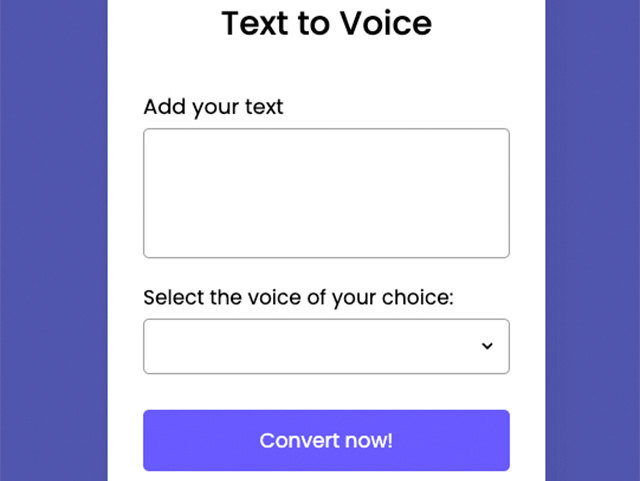

# Speechio

  

Speechio is a web application that converts text to speech. It allows users to input text and select a voice for the speech synthesis. Nothing gets saved in any server.

## Features

- Text input for speech conversion.
- Selection of different voices.
- Responsive design suitable for various devices.

## Installation

To run Speechio locally, follow these steps:

1. Clone the repository.
2. Open `index.html` in your web browser.

## Usage

1. Add the text you want to convert to speech in the textarea.
2. Select the desired voice from the dropdown.
3. Click the "Convert to Speech" button to hear the speech.

## Technologies Used

- HTML
- CSS
- JavaScript

## Contributing

Pull requests are welcome. For major changes, please open an issue first to discuss what you would like to change.